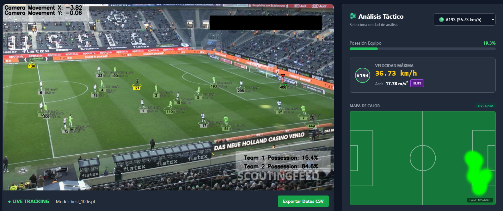

# AI Sport Vision Analytics ⚽📊

## Business Value
Automated telemetry extraction from raw broadcast footage to optimize player performance analysis and scouting processes. Reduces manual tagging time by [X]%.

## Technical Overview
Computer Vision pipeline that ingests video, detects entities, and projects 2D coordinates to a pitch map for physical metrics calculation.

## Tech Stack
* **Core:** Python 3.9
* **Computer Vision:** OpenCV, YOLOv8 (Object Detection)
* **Data Processing:** Pandas, NumPy (Vector calculation for speed/acceleration)
* **Visualization:** Matplotlib / Seaborn (Heatmaps)
* **Web Interface:** HTML5 / Flask

## Features
* [x] Player Identification & Tracking
* [x] Real-time Speed & Acceleration Metrics
* [x] Position Heatmap Generation

## Visuals

 
